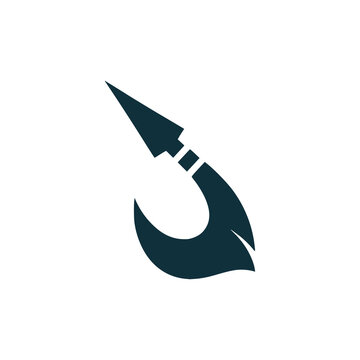

<p align="center">
  
</p>

# Harpoon — Fire and Forget Web-App Penetration Testing

**Author:** Blendi "blendFpwn" Ferizi  
**License:** MIT

Harpoon is a fire-and-forget web application penetration testing tool built to automate the entire testing process from start to finish. You provide a target, and it handles discovery, analysis, exploitation, and generates a clear, real-world impact report — reducing manual effort while maintaining professional-grade depth. Designed for security professionals who want faster workflows, consistent methodology, and actionable results.

---

## Table of Contents

1. [How It Works](#how-it-works)
2. [Prerequisites](#prerequisites)
3. [Quick Start (5 Minutes)](#quick-start-5-minutes)
4. [Full Dependency Installation](#full-dependency-installation)
   - [Python](#1-python-310)
   - [Nmap](#2-nmap)
   - [Gobuster](#3-gobuster)
   - [OWASP ZAP](#4-owasp-zap)
   - [Sqlmap](#5-sqlmap)
   - [Nuclei](#6-nuclei)
   - [Nikto](#7-nikto)
   - [ffuf](#8-ffuf)
   - [Metasploit Framework](#9-metasploit-framework)
   - [Ollama (AI Reports)](#10-ollama--ai-report-generation)
5. [Running Harpoon](#running-harpoon)
6. [What Each Phase Does](#what-each-phase-does)
7. [Output Files](#output-files)
8. [Environment Variable Overrides](#environment-variable-overrides)
9. [Building a Standalone Executable](#building-a-standalone-executable)
10. [Troubleshooting](#troubleshooting)
11. [Legal Disclaimer](#legal-disclaimer)

---

## How It Works

Harpoon orchestrates eight security tools in a structured pipeline where each phase feeds context into the next:

```
Target URL
    │
    ▼
DNS Recon ──────── Resolve IPs, detect CDN/WAF (Cloudflare, Akamai, etc.)
    │
    ▼
Phase 1: Nmap ──── Port scan, service detection, OS fingerprint
    │
    ▼
Phase 2: Gobuster + ffuf ─ Dir brute-force + vhost/subdomain discovery
    │
    ├──▶ Discovered paths + vhosts feed into Sqlmap, Nuclei, ffuf params
    ▼
Phase 3: ZAP + Sqlmap + Nikto + ffuf params + Nuclei ─── Web vuln scanning + SQLi + param fuzzing + CVE matching
    │
    ├──▶ Nmap services + Nuclei CVEs feed into Metasploit
    ▼
Phase 4: Metasploit ─── Automated exploitation attempts per service & CVE
    │
    ▼
Report Generation ──── Structured Markdown report + AI-assisted analysis
```

---

## Prerequisites

| Requirement        | Version  | Required? | Purpose                           |
|--------------------|----------|-----------|-----------------------------------|
| Python             | 3.10+    | Yes       | Harpoon runtime                   |
| Nmap               | 7.x+     | Yes       | Port scanning & service detection |
| Gobuster           | 3.x+     | Yes       | Directory enumeration             |
| OWASP ZAP          | 2.x+     | Recommended | Web vulnerability scanning     |
| Sqlmap             | 1.7+     | Recommended | SQL injection testing           |
| Nuclei             | 3.x+     | Recommended | Template-based CVE scanning     |
| Nikto              | 2.x+     | Recommended | Web server misconfiguration scanner |
| ffuf               | 2.x+     | Recommended | Fast directory, vhost, and parameter fuzzing |
| Metasploit Framework | 6.x+  | Recommended | Automated exploitation          |
| Ollama             | Latest   | Optional  | AI-powered report analysis        |

> Harpoon will still run if optional tools are missing — it logs what it couldn't find and skips that phase.

---

## Quick Start (5 Minutes)

If you already have the tools installed and on PATH:

```powershell
# 1. Clone the repo
git clone https://github.com/blendF/harpoon.git
cd harpoon

# 2. Install Python dependencies
pip install -r requirements.txt

# 3. Run Harpoon
python main.py
```

Harpoon will prompt you for:
1. **Target URL or IP** — e.g. `https://example.com` or `192.168.1.50`
2. **LHOST** — Your local IP for reverse shells (auto-detected, press Enter to accept default)

Then it runs all phases automatically and generates `Harpoon_Report.md` in the project directory.

---

## Full Dependency Installation

### 1. Python (3.10+)

Download from [python.org](https://www.python.org/downloads/) or install via winget:

```powershell
winget install Python.Python.3.12
```

**Important:** During installation, check **"Add Python to PATH"**.

Verify:
```powershell
python --version
# Python 3.12.x
```

### 2. Nmap

Nmap is required for Phase 1 (Reconnaissance).

**Windows:**
```powershell
# Option A: winget
winget install Insecure.Nmap

# Option B: Download installer from https://nmap.org/download.html
# Run the .exe installer — it adds itself to PATH automatically
```

**Default install path:** `C:\Program Files (x86)\Nmap\`

Verify:
```powershell
nmap --version
```

### 3. Gobuster

Gobuster is required for Phase 2 (Enumeration).

**Option A — Pre-built binary (recommended):**

Download the latest Windows release from [github.com/OJ/gobuster/releases](https://github.com/OJ/gobuster/releases).  
Extract `gobuster.exe` and either:
- Place it in `harpoon/tools/gobuster.exe` (Harpoon checks here first), or
- Add its folder to your system PATH

**Option B — Install via Go:**
```powershell
# Requires Go: winget install GoLang.Go
go install github.com/OJ/gobuster/v3@latest
```

Verify:
```powershell
gobuster version
```

> Harpoon ships with a 1,828-word wordlist at `harpoon/wordlist.txt`. It is used automatically.

### 4. OWASP ZAP

ZAP handles Phase 3 web application scanning (spider + active scan).

**Windows:**
```powershell
# Option A: winget
winget install OWASP.ZAP

# Option B: Download .exe installer from https://www.zaproxy.org/download/
```

**Default install path:** `C:\Program Files\ZAP\Zed Attack Proxy\`

Verify:
```powershell
# ZAP should have zap.bat in its install directory
where zap.bat
```

### 5. Sqlmap

Sqlmap handles SQL injection testing in Phase 3.

**Windows:**
```powershell
# Option A: pip (easiest)
pip install sqlmap

# Option B: Clone the repo
git clone https://github.com/sqlmapproject/sqlmap.git
# Then add sqlmap/ to PATH, or set HARPOON_SQLMAP=path\to\sqlmap.py
```

Verify:
```powershell
sqlmap --version
```

### 6. Nuclei

Nuclei runs template-based CVE and misconfiguration scanning in Phase 3.

**Option A — Pre-built binary (recommended):**

Download the latest Windows release from [github.com/projectdiscovery/nuclei/releases](https://github.com/projectdiscovery/nuclei/releases).  
Extract `nuclei.exe` and add to PATH.

**Option B — Install via Go:**
```powershell
# Requires Go: winget install GoLang.Go
go install -v github.com/projectdiscovery/nuclei/v3/cmd/nuclei@latest
```

**Option C — Build from source (for development):**
```powershell
# Clone into harpoon project root as nuclei-dev/nuclei-dev/
# Harpoon will auto-detect bin/nuclei.exe in that folder
```

On first run, Harpoon automatically runs `nuclei -update-templates` to download the latest vulnerability templates.

Verify:
```powershell
nuclei -version
```

### 7. Nikto

Nikto scans for web server misconfigurations, outdated software, dangerous default files, and known vulnerabilities in Phase 3.

**Option A — Install via Git (recommended):**
```powershell
git clone https://github.com/sullo/nikto.git
```
Add the `nikto/program` folder to your system PATH, or set `HARPOON_NIKTO` to point to `nikto.pl`.

> **Note:** Nikto is a Perl script. On Windows you need Perl installed (e.g. [Strawberry Perl](https://strawberryperl.com/)). On Linux/macOS, Perl is typically pre-installed.

**Option B — Kali Linux:**
Nikto comes pre-installed on Kali.

**Option C — Package manager (Linux):**
```bash
sudo apt install nikto
```

Verify:
```powershell
nikto -Version
```

### 8. ffuf

ffuf (Fuzz Faster U Fool) handles fast directory fuzzing, virtual host / subdomain discovery, and parameter fuzzing in Phases 2 and 3.

**Option A — Pre-built binary (recommended):**

Download the latest release from [github.com/ffuf/ffuf/releases](https://github.com/ffuf/ffuf/releases).
Extract `ffuf` (or `ffuf.exe` on Windows) and add to PATH.

**Option B — Install via Go:**
```powershell
# Requires Go: winget install GoLang.Go
go install github.com/ffuf/ffuf/v2@latest
```

**Option C — Package manager (Linux):**
```bash
sudo apt install ffuf
```

Harpoon ships with bundled wordlists for subdomain discovery (522 entries) and parameter fuzzing (356 entries) at `harpoon/wordlists/`. Directory fuzzing reuses the existing 1,828-word wordlist.

Verify:
```powershell
ffuf -V
```

### 9. Metasploit Framework

Metasploit handles Phase 4 (Exploitation). It attempts automated exploits based on discovered services and CVEs from Nuclei.

**Windows (.msi installer — recommended):**

1. Download the installer:
   ```
   https://windows.metasploit.com/metasploitframework-latest.msi
   ```
2. Run the `.msi` as **Administrator**
3. Default install location: `C:\metasploit-framework\`
4. Add the bin folder to PATH:

   ```powershell
   # Open PowerShell as Administrator, then:
   [System.Environment]::SetEnvironmentVariable(
       "PATH",
       $env:PATH + ";C:\metasploit-framework\bin",
       [System.EnvironmentVariableTarget]::Machine
   )
   ```
5. **Restart your terminal** after modifying PATH.

**Linux:**
```bash
curl -sL https://raw.githubusercontent.com/rapid7/metasploit-omnibus/master/config/templates/metasploit-framework-wrappers/msfupdate.erb > msfinstall
chmod 755 msfinstall
sudo ./msfinstall
```

**Alternative — Local source (advanced):**

If you have the Metasploit source code, place it at:
```
harpoon/metasploit-framework-master/metasploit-framework-master/
```
Harpoon will auto-detect `msfconsole` there and invoke it via Ruby. This requires Ruby to be installed and on PATH.

Verify:
```powershell
msfconsole --version
# or
msfconsole.bat --version
```

### 10. Ollama — AI Report Generation

Ollama is used to generate the AI-assisted analysis section of the report using the `qwen3.5:cloud` model. This is optional but highly recommended for actionable, human-readable reports.

1. Install Ollama:
   ```powershell
   winget install Ollama.Ollama
   ```
   Or download from [ollama.com](https://ollama.com/download).

2. Pull the model:
   ```powershell
   ollama pull qwen3.5:cloud
   ```

3. Test it works:
   ```powershell
   ollama run qwen3.5:cloud "Hello, test"
   ```

> `qwen3.5:cloud` runs via Ollama's cloud infrastructure — no GPU required, but internet is needed. No API key necessary.

Verify:
```powershell
ollama list
# Should show qwen3.5:cloud in the list
```

**Using a different model:** Set the environment variable before running Harpoon:
```powershell
$env:HARPOON_OLLAMA_MODEL = "llama3:8b"
python main.py
```

---

## Running Harpoon

```powershell
cd harpoon
python main.py
```

### What You'll See

```
$$\                                                                   
$$ |                                                                  
$$$$$$$\   $$$$$$\   $$$$$$\   $$$$$$\   $$$$$$\   $$$$$$\  $$$$$$$\  
...

  by Blendi "blendFpwn" Ferizi
  "Fire and forget web-app penetration testing tool."

Enter target IP address or domain name: https://target.com
Enter LHOST for reverse shells [default: 192.168.1.5] (or press Enter to use default):

DNS Recon on target: target.com
  Resolved IP(s): 104.21.x.x, 172.67.x.x
  WARNING: Target appears to be behind Cloudflare.
  Scans may be rate-limited or blocked by WAF. Adjusting scan parameters.

Phase 1 – Reconnaissance on target: target.com
  [Nmap – Network Mapper]  Est. 3–10 min
  ⠋ ...
  done.

Phase 2 – Enumeration on target: target.com
  [Gobuster – Dir/File brute-force]  Est. 2–5 min (1,800 words)
  ⠋ ...
  Enumeration complete.
  [ffuf – Fast dir/file fuzzing]  Est. 1–2 min
  ⠋ ...
  ffuf dir: 15 path(s) discovered.
  [ffuf – Virtual host / subdomain discovery]  Est. 1–2 min
  ⠋ ...
  ffuf vhost: 3 subdomain(s) discovered.

Phase 3 – Web Application Scanning on target: target.com
  [OWASP ZAP – Zed Attack Proxy]  Est. 5–15 min
  ⠋ ...
  done.
  [Sqlmap – SQL injection testing]  Est. 2–5 min
  ⠋ ...
  done.
  [Nikto – Web server scanner]  Est. 2–5 min
  ⠋ ...
  Nikto scan complete.
  [ffuf – Parameter fuzzing (GET+POST)]  Est. 2–5 min
  ⠋ ...
  ffuf params: 4 parameter(s) discovered across 5 page(s).
  [Nuclei – Template-based vuln scanner]  Est. 5–10 min (CDN rate-limited)
  ⠋ ...
  Scan complete (12 targets, tags: cve,apache,nginx).

Phase 4 – Exploitation on target: target.com
  [Metasploit Framework – MSF]  Est. 1–3 min per service (3 services)
  ⠋ ...
  Metasploit: 3 exploit(s) attempted, no sessions obtained.

Generating report… done.
Report: C:\Users\you\harpoon\Harpoon_Report.md

Enhancing report with AI-assisted analysis (qwen3.5:cloud)…  Est. 1–3 min
  Generating technical analysis with real-world impact assessment… done.
```

### Estimated Run Times

| Phase | Tool | Estimated Time |
|-------|------|---------------|
| Pre-scan | DNS Recon | < 5 seconds |
| Phase 1 | Nmap | 3–10 minutes |
| Phase 2 | Gobuster | 2–5 minutes |
| Phase 2 | ffuf (dir + vhost) | 2–4 minutes |
| Phase 3 | OWASP ZAP | 5–15 minutes |
| Phase 3 | Sqlmap | 2–5 minutes |
| Phase 3 | Nikto | 2–5 minutes |
| Phase 3 | ffuf (params) | 2–5 minutes |
| Phase 3 | Nuclei | 5–10 minutes |
| Phase 4 | Metasploit | 1–3 min per service |
| Report | Ollama AI | 1–3 minutes |

**Total estimated scan time: 20–50 minutes** depending on target size, network speed, and number of open services.

---

## What Each Phase Does

### DNS Recon (Pre-scan)
- Resolves the target hostname to IP addresses
- Performs reverse DNS lookups
- Detects CDN/WAF presence (Cloudflare, Akamai, Fastly, Incapsula, Sucuri, AWS CloudFront)
- If a CDN is detected, downstream tools (Nuclei) are automatically rate-limited to avoid being blocked

### Phase 1: Reconnaissance (Nmap)
- Full TCP port scan with service version detection (`-sV`)
- Default NSE scripts for common vulnerabilities (`-sC`)
- OS fingerprinting (`-O`)
- Verbose output with connection reasons (`-v --reason`)

### Phase 2: Enumeration (Gobuster + ffuf)
- **Gobuster** — Directory and file brute-force against the target using the bundled 1,828-word wordlist. Handles wildcard/SPA responses automatically
- **ffuf dir** — Fast parallel directory/file fuzzing (50 threads) as a complementary pass using the same wordlist
- **ffuf vhost** — Virtual host / subdomain discovery by fuzzing the `Host:` header with a bundled 522-entry subdomain wordlist. Uses auto-calibration (`-ac`) to filter false positives
- Discovered paths and subdomains feed into Sqlmap, Nuclei, and ffuf param fuzzing

### Phase 3: Web Application Scanning
- **OWASP ZAP** — Automated spider + active scan for XSS, CSRF, injection, misconfigurations
- **Sqlmap** — SQL injection testing against the target URL and all Gobuster-discovered paths, with `--level=3 --risk=2` and verbose output (`-v 3`)
- **Nikto** — Web server scanner that checks for outdated software, dangerous default files/CGIs, server misconfigurations, and known vulnerabilities (OSVDB/CVE). Runs comprehensive checks (`-C all`) in non-interactive mode
- **ffuf params** — GET and POST parameter fuzzing against the base URL and top discovered paths, using a bundled 356-entry parameter wordlist. Discovered parameters expand the attack surface for injection testing
- **Nuclei** — Template-based scanning using tags derived from Nmap service detection. Targets include the base URL plus all Gobuster-discovered paths, ffuf-discovered paths, and ffuf-discovered vhosts

### Phase 4: Exploitation (Metasploit)
- For each open service found by Nmap, generates a Metasploit resource script (.rc) that searches for and runs relevant exploits
- For each CVE found by Nuclei, generates a separate exploit attempt
- Uses your LHOST for reverse shell payloads
- Stops immediately if a session (shell/meterpreter) is obtained
- 180-second timeout per exploit attempt

### Report Generation
- **Quick report** — Immediately generated from parsed tool output. Includes per-port risk assessment, real-world impact descriptions, and an overall risk rating (CRITICAL/HIGH/MEDIUM/LOW)
- **AI-enhanced report** — If Ollama is available, generates a detailed AI-assisted analysis section with critical findings, attack surface summary, positive findings, and prioritized remediation actions

---

## Output Files

After a scan, these files are created:

```
harpoon/
├── Harpoon_Report.md              ← Main report (open this)
└── harpoon_logs/
    ├── dns_recon.txt              ← DNS resolution & CDN detection
    ├── nmap_scan.txt              ← Full Nmap output (ports, services, scripts)
    ├── gobuster_enum.txt          ← Directory brute-force results
    ├── zap_scan.txt               ← OWASP ZAP spider + alerts (XML)
    ├── sqlmap_scan.txt            ← SQL injection test details & payloads
    ├── nuclei_scan.txt            ← CVE/misconfiguration matches
    ├── nuclei_targets.txt         ← Target URLs fed to Nuclei
    ├── nikto_scan.txt             ← Nikto web server scan findings
    ├── ffuf_dir.json              ← ffuf directory/file fuzzing results
    ├── ffuf_vhost.json            ← ffuf virtual host/subdomain discovery
    ├── ffuf_params.json           ← ffuf parameter fuzzing results
    ├── metasploit_exploits.txt    ← MSF exploit attempts & session status
    ├── msf_*.rc                   ← Generated Metasploit resource scripts
    └── msf_out_*.txt              ← Per-exploit Metasploit output
```

The `harpoon_logs/` directory contains full verbose output from every tool for deep technical review.

---

## Environment Variable Overrides

If a tool is installed in a non-standard location, override its path:

| Variable | Default | Example |
|----------|---------|---------|
| `HARPOON_NMAP` | `nmap` | `C:\tools\nmap.exe` |
| `HARPOON_GOBUSTER` | `gobuster` | `C:\tools\gobuster.exe` |
| `HARPOON_ZAP` | `zap.sh` | `C:\Program Files\ZAP\zap.bat` |
| `HARPOON_SQLMAP` | `sqlmap` | `C:\Python\Scripts\sqlmap` |
| `HARPOON_NUCLEI` | `nuclei` | `C:\Go\bin\nuclei.exe` |
| `HARPOON_NIKTO` | `nikto` | `C:\nikto\program\nikto.pl` |
| `HARPOON_FFUF` | `ffuf` | `C:\Go\bin\ffuf.exe` |
| `HARPOON_MSFCONSOLE` | `msfconsole` | `C:\metasploit-framework\bin\msfconsole.bat` |
| `HARPOON_OLLAMA` | `ollama` | `C:\Users\you\AppData\Local\Programs\Ollama\ollama.exe` |
| `HARPOON_OLLAMA_MODEL` | `qwen3.5:cloud` | `llama3:8b` |
| `HARPOON_OLLAMA_TIMEOUT` | `180` | `300` (seconds) |

**PowerShell example:**
```powershell
$env:HARPOON_NMAP = "C:\tools\nmap.exe"
$env:HARPOON_MSFCONSOLE = "C:\metasploit-framework\bin\msfconsole.bat"
python main.py
```

---

## Building a Standalone Executable

You can package Harpoon into a single `.exe` using PyInstaller:

```powershell
pip install pyinstaller
pyinstaller harpoon.spec
```

The executable will be in `dist/`. Note that the external tools (Nmap, Gobuster, etc.) still need to be installed separately — the `.exe` only bundles the Python code and wordlist.

To include `gobuster.exe` in the bundle, place it at `tools/gobuster.exe` before building.

---

## Troubleshooting

### "Nmap not found"
- Ensure Nmap is installed and on PATH: `nmap --version`
- On Windows, Nmap installs to `C:\Program Files (x86)\Nmap\` — Harpoon checks this automatically
- Override: `$env:HARPOON_NMAP = "C:\path\to\nmap.exe"`

### "Gobuster not found"
- Download from [releases](https://github.com/OJ/gobuster/releases) and place in `tools/gobuster.exe` or add to PATH
- Override: `$env:HARPOON_GOBUSTER = "C:\path\to\gobuster.exe"`

### "Metasploit (msfconsole) not found"
- Download the MSI installer: `https://windows.metasploit.com/metasploitframework-latest.msi`
- Run as Administrator. Default path: `C:\metasploit-framework\bin\`
- Add to PATH or set: `$env:HARPOON_MSFCONSOLE = "C:\metasploit-framework\bin\msfconsole.bat"`
- **Restart your terminal** after modifying PATH

### "Nuclei not found"
- Install via Go: `go install -v github.com/projectdiscovery/nuclei/v3/cmd/nuclei@latest`
- Or download from [releases](https://github.com/projectdiscovery/nuclei/releases) and add to PATH
- Harpoon also checks `nuclei-dev/nuclei-dev/bin/nuclei.exe` in the project root

### "Nikto not found"
- Clone the repo: `git clone https://github.com/sullo/nikto.git` and add `nikto/program` to PATH
- On Windows, Nikto requires Perl — install [Strawberry Perl](https://strawberryperl.com/)
- Override: `$env:HARPOON_NIKTO = "C:\path\to\nikto.pl"`

### "ffuf not found"
- Install via Go: `go install github.com/ffuf/ffuf/v2@latest`
- Or download from [releases](https://github.com/ffuf/ffuf/releases) and add to PATH
- Harpoon also checks WSL if ffuf is installed there
- Override: `$env:HARPOON_FFUF = "C:\path\to\ffuf.exe"`

### "OWASP ZAP not found"
- Install via winget: `winget install OWASP.ZAP`
- Or download from [zaproxy.org](https://www.zaproxy.org/download/)
- Harpoon checks `C:\Program Files\ZAP\Zed Attack Proxy\zap.bat`

### "Sqlmap not found"
- Install via pip: `pip install sqlmap`
- Or clone the repo and add to PATH

### Gobuster shows "wildcard responses" or "503"
- This means the target server returns the same response for all paths (common with SPAs/React apps) or is rate-limiting
- Harpoon automatically retries with `--exclude-length` and status code filtering
- Results may be limited for these targets

### Nuclei is slow or stuck
- If the target is behind a CDN/WAF, Harpoon automatically rate-limits Nuclei to 50 req/s
- Nuclei timeout is set to 10 minutes; for large targets, this may not be enough
- On first run, `nuclei -update-templates` downloads ~4,000+ templates (takes 1–2 minutes)

### Report is empty or minimal
- Ensure Ollama is installed and `qwen3.5:cloud` is pulled: `ollama pull qwen3.5:cloud`
- Test Ollama works: `ollama run qwen3.5:cloud "test"`
- Internet is required for cloud models
- The quick report (without AI) is always generated regardless of Ollama availability

### UnicodeDecodeError on Windows
- Harpoon handles this automatically with UTF-8 encoding and error replacement
- If issues persist, set: `$env:PYTHONIOENCODING = "utf-8"`

---

## Project Structure

```
harpoon/
├── main.py                        ← Entry point
├── requirements.txt               ← Python dependencies
├── harpoon.spec                   ← PyInstaller build spec
├── HARPOONASCIIART.txt            ← ASCII banner art
├── LICENSE                        ← MIT License
├── README.md                      ← This file
│
├── harpoon/                       ← Core package
│   ├── config.py                  ← Paths, tool names, env var overrides
│   ├── runner.py                  ← Generic subprocess runner with logging
│   ├── spinner.py                 ← CLI loading animation
│   ├── startup.py                 ← ASCII art display
│   ├── target.py                  ← Target & LHOST input handling
│   ├── logs.py                    ← Log directory setup
│   ├── recon.py                   ← DNS lookup & CDN/WAF detection
│   ├── report.py                  ← Report generation (parsing + Markdown)
│   ├── ollama_client.py           ← Ollama LLM integration
│   ├── nuclei_context.py          ← Nuclei target/tag builder from Nmap+Gobuster+ffuf
│   ├── wordlist.txt               ← Bundled 1,828-word directory wordlist
│   │
│   ├── scanners/                  ← Tool wrappers
│   │   ├── nmap_scan.py
│   │   ├── gobuster_scan.py
│   │   ├── nuclei_scan.py
│   │   ├── zap_scan.py
│   │   ├── sqlmap_scan.py
│   │   ├── nikto_scan.py
│   │   └── ffuf_scan.py
│   │
│   │
│   ├── wordlists/                 ← Bundled fuzzing wordlists
│   │   ├── subdomains.txt         ← 522-entry subdomain wordlist
│   │   └── params.txt             ← 356-entry parameter wordlist
│   │
│   ├── parsers/                   ← Output parsers
│   │   └── nmap_parser.py
│   │
│   └── exploit/                   ← Exploitation
│       └── metasploit_runner.py
│
└── tools/                         ← Optional bundled binaries
    └── gobuster.exe               ← Place Gobuster binary here
```

---

## Legal Disclaimer

**Harpoon is intended for authorized security testing only.**

- Only use Harpoon against systems you own or have **explicit written permission** to test.
- Unauthorized access to computer systems is illegal under laws including the Computer Fraud and Abuse Act (CFAA), Computer Misuse Act, and equivalent legislation worldwide.
- The author assumes no liability for misuse of this tool.
- Always obtain proper authorization before conducting any penetration test.

---

*Built with purpose by Blendi "blendFpwn" Ferizi.*
