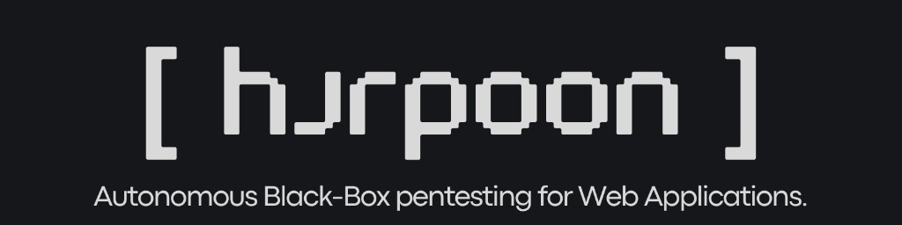

<p align="center">
  
</p>

<h1 align="center"><strong>Harpoon. - Fire and Forget.</strong></h1>

Harpoon is a tool for **autonomous black-box penetration testing of web applications**. It is **optimized for Kali Linux**: it orchestrates scanners that are already part of a typical Kali image, adds **ProjectDiscovery** and related tools that are not (see **`scripts/setup.sh`** for the exact `go install`, Rust **x8** binary, and Python venv steps), and layers Harpoon’s own pipeline logic, SQLite state, and reporting on top. **Few extra moving parts** are required beyond what that script installs. You can also run Harpoon on **other Debian-based distributions** or **WSL on Windows** after installing the same class of dependencies (use `setup.sh` on apt-based systems, or map its steps to your package manager).

Harpoon does **not** replace professional judgment or authorization: use it only on systems you are permitted to test.

---

## How to set up

Three steps: get the code, run the installer, run the app.

### 1. Download from Git

```bash
git clone https://github.com/blendF/harpoon.git
cd harpoon
```

(Use your fork or URL if different.)

### 2. Install dependencies

On **Debian / Ubuntu / Kali / WSL** with `apt` and `sudo`:

```bash
bash scripts/setup.sh
```

This script:

- Installs OS packages (e.g. **SecLists**, **nmap**, **sqlmap**, **nikto**, **curl**, **golang-go**, **ZAP**, build deps for **libpcap** / CGO, **python3-venv**, **git**).
- Builds and installs **Go** tools (ProjectDiscovery stack, **ffuf**, **waybackurls**, **gau**, **gowitness**, etc.).
- Installs **x8** from the upstream **Rust** release on **x86_64** Linux (see script for other architectures).
- Creates **`./.venv`** and installs Harpoon’s **Python** dependencies there (PEP 668–safe on modern Kali), including **ParamSpider** from GitHub (not reliably on PyPI for newer Python).

**Git** must be available for the ParamSpider install.

### 3. Run Harpoon

From the repository root:

```bash
bash scripts/run_harpoon.sh
```

This wrapper extends **`PATH`** with **`./.venv/bin`**, **`~/go/bin`**, **`~/.local/bin`**, and **`~/.cargo/bin`**, prefers the venv’s **Python** when present, and loads **`.harpoon.env`** if you created it from **`.harpoon.env.example`**.

---

## Architecture & behavior (deep dive)

### What Harpoon does in the background

Harpoon is an **orchestrator**: it does not implement every scan itself. It **runs external tools** as subprocesses, **normalizes** their output into a **relational SQLite model**, applies **WAF-aware** choices where configured, then **validates** findings and emits **HTML** reports and **proof-of-concept** style artifacts. Execution is **async** end-to-end (`asyncio` + non-blocking subprocess I/O).

### Pipeline phases (`main.py`)

Rough flow from target prompt to report:

| Phase | Name | Role |
|------:|------|------|
| 0 | DNS recon | Resolve IPs, basic CDN signal from DNS/recon log |
| 1 | Passive recon | **subfinder**, **crt.sh**, **amass** → subdomains in state |
| 2 | Active DNS + infra | **dnsx**, **nmap** on resolved hosts |
| 3 | HTTP + WAF | **httpx**, **cdncheck** data, **WAF** detection → URLs, tech tags, WAF flag |
| 4 | Visual recon | **gowitness** (screenshots where configured) |
| 5 | Content discovery | **ffuf** directory + vhost discovery → paths/vhosts in state |
| 6 | Crawl + history | **katana**, **waybackurls**, **gau** → more URLs |
| 7 | JS analysis | Extract endpoints / high-entropy secrets from JS URLs |
| 8 | Parameters | **paramspider**, **arjun**, **ffuf** parameter discovery → parameters in state |
| 9 | Validation | **sqlmap**, **nikto** (WAF-aware skip), **nuclei** with context from state and logs |
| 10 | PoC + reporting | Deterministic **PoC** generation from tool outputs, **SQLite** snapshot, **HTML** report via `viewreport.py` |

The **preflight** module (`harpoon/preflight.py`) runs **before** this pipeline: if a **required** binary or **SecLists** (or bundled-wordlist opt-in) is missing, Harpoon **exits** and prints grouped fix hints (**apt**, **`go install`**, venv pip lines aligned with **`setup.sh`**, and **x8** notes).

### State & SQLite

`harpoon/state.py` persists a **session database** (under `harpoon_logs/sessions/<session>/`) with tables such as **targets**, **subdomains**, **endpoints**, **technologies**, **parameters**, and **vulnerabilities**. Phases **read and write** this state so later tools see a accumulated attack surface.

### Runner

`harpoon/runner.py` exposes **`run_tool`** / **`run_tool_json`** and resolves CLIs via **`find_cmd`**, which searches **`PATH`** plus common install locations (**`~/.local/bin`**, **`~/go/bin`**, repo **`.venv/bin`** / **`.venv/Scripts`**).

### Scanners

Each external tool has a thin **async** wrapper under `harpoon/scanners/`. Wrappers build arguments, call the runner, and parse logs or structured output where applicable.

### WAF & rate limits

`harpoon/waf.py` combines signals (e.g. headers, **cdncheck**, behavioral probes) to infer WAF presence. Downstream phases can **throttle** or **skip** noisy checks when a WAF is likely.

### Wordlists & SecLists

**ffuf** and related steps expect quality wordlists. Harpoon checks for **SecLists** (e.g. `/usr/share/seclists`) or **`HARPOON_SECLISTS_DIR`**. If you cannot install SecLists, set **`HARPOON_USE_BUNDLED_WORDLISTS=1`** (see `.harpoon.env.example`) to use bundled lists under `harpoon/wordlists/` with **narrower** coverage.

### HTML report

After a run, an **HTML** report is generated. You can also render one manually:

```bash
python viewreport.py --target example.com --db harpoon_logs/sessions/<session>/pipeline_state.db --poc-log harpoon_logs/sessions/<session>/poc_findings.json --serve
```

### Tests

After **`setup.sh`**, the venv includes **pytest**. From the repo root:

```bash
./.venv/bin/pytest -q
```

### Windows

Native Windows is not the primary target: use **WSL**, run **`bash scripts/setup.sh`** and **`bash scripts/run_harpoon.sh`**, and keep tool binaries visible to the same environment as Python.

---

## Tool reference

**Authoritative list** of what gets installed on apt-based systems: **`scripts/setup.sh`**.  
**Preflight** enforces a **fixed set** of executable names on **`PATH`** (plus SecLists / bundled flag); if you trim tools, adjust **`harpoon/preflight.py`** and the pipeline to match.
